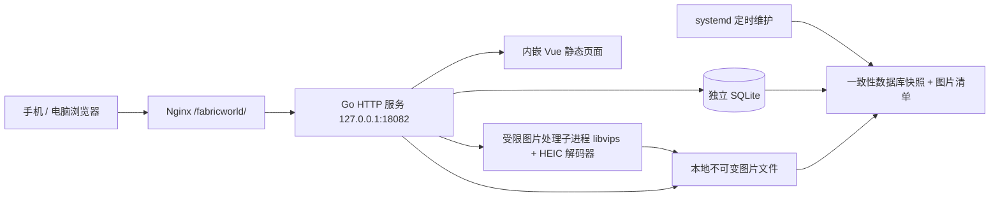

# FabricWorld 技术方案

状态：已审核并进入实施。日期：2026-09-19。当前实现与验证以 ARCHITECTURE、OPERATIONS 和 VERIFICATION 为准。

本方案为用户已审核的设计基线；随后明确 GitHub 仓库使用 public。文中的性能指标仍是目标，是否达成以验收文档为准。

## 1. 推荐方案与审核项

将 FabricWorld 做成一个以照片为主的布料收藏工具：打开就能看到已有布料，拍照后可立即保存，再按需补齐材质、尺寸、收纳位置和购买信息；使用布料后能更新余料，购物时能快速判断家里有没有相似材料。

推荐技术路线：**Vue 3 + TypeScript + Go + SQLite + 本地图片文件**。沿用 ali 的 Nginx、systemd 和子路径部署方式，新增图片处理工具 libvips 及 HEIC 解码依赖。前端构建产物嵌入 Go 程序，服务器不运行前端构建或 Node 应用。

| 决策 | 本方案建议 | 对使用的影响 |
| --- | --- | --- |
| 使用范围（已确认） | 一个共享布料库；同一网址、所有设备看到同一份数据 | 无登录，也没有个人数据隔离；拿到地址的人可查看、上传、修改和删除 |
| 首版重点 | 照片入库、材质尺寸、搜索筛选、收纳位置、余料、回收站、导出 | 覆盖买入、查找、使用和找回误删记录 |
| 网络入口 | 先复用 HTTP 的 `/fabricworld/`，通过系统文件选择器拍照 | 以实机验证拍照兼容性；不把完整 PWA 和网页相机预览列入 HTTP 版承诺 |
| 照片保存 | 保存清理过元数据、最长边 2560 px 的标准照片及缩略图 | 控制空间和加载速度；导出的是处理后的照片，不是原始摄影文件 |
| 部署 | 独立服务、数据库、数据目录与发布身份；图片本地存储 | 暂不引入对象存储费用或额外数据库服务 |
| GitHub | `Crashmere/FabricWorld`，可见性 public（已确认） | 在审核通过、进入实施阶段时创建；公开源码可单独调整 |

用户已明确不设置登录与身份认证，并在本轮确认“共享布料库，持有网址的人可查看和编辑”。本方案不引入密码、访问令牌或账号，也不做个人数据隔离；该项已经确认，无需重复审核。

## 2. 已核对的环境与约束

2026-09-19 通过本地检查、受信 SSH 别名 `ali` 和 GitHub 只读接口核对：

- 开始规划时当前目录为空，未初始化 Git；本轮只新增方案及文档入口。当前 GitHub 身份为 `Crashmere`，该身份下未查到 `FabricWorld` 仓库。仓库创建前会再次检查。
- 显式读取了服务器 `/opt/AGENTS.md`；远端四份共享运维参考文档与本地维护源的 SHA-256 一致。
- ali 为 2 vCPU、约 1.7 GiB 内存；核对时可用内存约 1.25 GiB，无 swap；40 GiB 根盘约有 33 GiB 可用。资源余量不是容量保证。
- Nginx 当前仅配置 HTTP 80，以路径分发应用；Ledger 使用 `127.0.0.1:18080`，FeeTable 使用 `127.0.0.1:18081`。两个服务与 Nginx 均 active，代理健康接口均成功。
- `18082` 未监听，`/opt/fabricworld` 尚不存在。它们只是候选值，部署前重新确认占用。
- Ubuntu 已配置的软件源中有 `libvips-tools` 与 `libheif-plugin-libde265` 候选包，当前未安装；已安装 `libheif1`。有候选包不等于已经验证 HEIC 解码。

服务器共享约定由 `agent-config/skills/server-operations` 维护。本项目只拥有自己的应用配置。生产地址、密钥、真实照片、数据库和备份不写入 Git。

## 3. 首版产品范围

### 3.1 布料记录

一条记录表示同一次购入、准备放在一起管理的一种布料；同款再次购买可以复制基础信息后另建记录。复制操作不复制照片文件引用、购买日期或余料，避免两批库存混在一起。

| 信息 | 设计 |
| --- | --- |
| 照片 | 每条最多 10 张；支持手机拍照、相册、电脑选择文件及拖放；可设封面、移动顺序、移除、查看大图 |
| 名称 | 可手填，例如“蓝色小花棉布”；不填时用“布料 + 录入日期”生成，可稍后改名 |
| 材质 | 常见纤维多选并允许自定义，如棉、麻、羊毛、涤纶；成分说明可填“棉 70% / 麻 30%” |
| 尺寸与数量 | 每组布片记录幅宽、长度和相同尺寸的片数；支持多组不同尺寸 |
| 状态 | 未使用、使用中、已用完；默认未使用 |
| 收纳位置 | 自定义文字并提示已有值，例如“衣柜上层 / 2 号箱” |
| 可选信息 | 颜色、花型/用途标签、购买日期、店铺、购买总价、备注 |

快速入库时不强制填写尺寸或材质。至少有照片或手填名称即可创建，未测量尺寸明确显示“待补充”，不以 0 替代未知。无照片的记录也能保存，使用轻量占位卡片。

材质用于搜索与识别，首版不把混纺比例做成复杂配方系统。用户输入的比例说明原样保留，不声称已经校验成分总和。购买总价是原始购入成本，不随余料变化折算。

### 3.2 尺寸与余料规则

- UI 默认以厘米输入，可切换米；服务端统一存整数毫米，厘米最多一位小数、米最多三位小数。例：幅宽 150 cm、长度 2.5 m，保存为 1500 mm × 2500 mm。
- 每组片数为正整数；宽、长可以分别未知，已知时必须大于 0。首版拟限制每条 50 组、每组最多 999 片、每个尺寸不超过 1000 m，后端与前端共同校验。
- 新记录默认一片待测量布料。记录有库存时至少有一组；“未使用”和“使用中”有布片，“已用完”无剩余布片。状态与布片修改在同一事务内校验。
- 详情页提供“更新余料”：直接填写现在剩下的尺寸、拆成多片或调整片数。例：150 × 250 cm 用掉一段后改成 150 × 180 cm；分成两块后保存两组尺寸。
- 通过“更新余料”提交变化时默认转为“使用中”；普通编辑中补充待测量尺寸或更正录入错误不自动改变状态。“标记用完”需确认，移除当前布片并保留修改前快照；重新补充布片时转为“使用中”。
- 不规则余料可记录最大宽长和形状备注；该尺寸用于辨识，不代表可裁出的矩形。满足尺寸的筛选默认只包含完整矩形，未知或不规则尺寸不承诺可用。
- 每次保存记录变更摘要及变更前后的业务快照，便于查看原始购入尺寸和余料变化；不记录修改人，因为没有身份系统。首版提供查看历史，不提供复杂的历史合并或任意版本回滚。
- 不把不同幅宽的布料合计成一个容易误解的“总米数”。首页统计记录数、在库记录数和待补充信息数即可。

### 3.3 查找、整理与导出

- 搜索名称、材质、标签、店铺、收纳位置和备注，支持中文包含匹配。
- 按材质、颜色、状态、收纳位置、标签筛选，支持最低长度/幅宽筛选；尺寸筛选按某一组剩余矩形布片同时满足条件，不把多片拼接成一块。默认不自动旋转经纬方向。
- 默认按最近购入排序，缺少购买日期时用录入日期；也可按最近修改、名称排序。排序加稳定的 ID 作为并列规则。
- 首屏分页加载 24 条，滚动后可点“加载更多”；返回详情前保留筛选和列表位置。筛选与排序进入 URL，便于刷新和电脑打开。
- 删除进入回收站，保留 30 天，可恢复；过期后由维护任务清理。常规界面不提供绕过回收站的立即永久删除。已用完与删除是不同状态。
- 可导出记录 CSV，以及包含 JSON 清单和标准照片的 ZIP。CSV 对公式前缀做转义；ZIP 流式生成、限制并发，避免把照片全集放入内存。默认导出在库记录（未使用、使用中），可明确选择包含已用完；回收站记录不包含在常规导出中。
- ZIP 是数据携带格式；首版不提供网页导入/恢复。完整灾难恢复走运维备份。

首版暂不包含：AI 材质识别、自动从照片测量尺寸、购物网站采集、裁剪排料算法、完整缝纫项目管理、社交分享、用户体系、离线同步和多库权限。照片不能可靠测量真实尺寸，尺寸始终由用户确认。

## 4. 手机与电脑交互

### 4.1 主要页面

| 页面 | 手机 | 电脑 |
| --- | --- | --- |
| 布料库 | 两列照片卡片，顶部搜索，筛选用底部面板，右下固定“新增”；极窄宽度按内容退为一列 | 自适应 3–5 列卡片，筛选可在侧边展开 |
| 新增 / 编辑 | 独立页面，照片在上，材质尺寸在中，可选信息折叠；底部固定保存区 | 有限最大宽度的表单，照片与字段分列 |
| 布料详情 | 大图、状态、剩余尺寸、收纳位置依次展示；编辑和更新余料容易触达 | 左侧图库、右侧信息，历史独立区域 |
| 回收站 | 卡片列表、删除日期、恢复入口 | 同样功能，利用更宽布局 |

视觉方向采用暖白底、低饱和辅助色和清楚的文字层级，以布料照片为主体。界面中文优先，主标题可用“我的布料”；不添加与管理任务无关的装饰或宣传文案。

### 4.2 快速拍照流程

1. 点击“新增”，选择“拍照”或“从相册选择”。两个入口分开，电脑显示文件选择与拖放。
2. 图片先显示本地预览和每张进度，后台按顺序上传；HEIC 无法本地预览时显示处理中占位。用户可以同步填写信息。
3. 显示材质、尺寸与收纳位置；可不补充直接保存。存在选中但未成功上传的照片时，保存前须重试或明确移除，不能悄悄漏图。
4. 保存成功后进入详情，可选择“继续录入”；失败保留输入和已成功上传的照片。

拍照入口使用 `<input type="file" accept="image/*" capture="environment">` 请求后置摄像头；相册入口不设置 `capture`，允许多选。`capture` 是浏览器提示，不保证所有浏览器都直接打开相机，需保留系统选择器降级体验。

### 4.3 可用性与弱网

- 常用触控区域至少 44 × 44 CSS px，输入框字体至少 16 px；数字字段用合适的 `inputmode`。适配安全区、横竖屏和软键盘，保存按钮不能遮挡最后一个字段。
- 卡片保留固定图片比例，文字最多显示必要行数；标签过多时收起，避免布局跳动。状态除了颜色还显示文字。
- 返回列表恢复位置；筛选提交才更新结果；无结果、无照片、首次使用、上传失败都有可执行的下一步。
- 当前表单在会话内保存文字草稿；刷新后恢复文字和仍有效的暂存照片引用。浏览器刷新会丢失未上传的本地文件，需要明确提示重新选择。草稿不是正式数据或离线写入队列。
- 断网时明确显示未保存；服务端成功确认后才清除草稿。写入使用幂等请求，超时后先确认结果，再决定重试，避免移动网络重传造成重复记录。
- 提供键盘操作、焦点反馈、表单关联标签与行内错误；不把滑动、长按或拖动作为唯一操作方式。照片排序也提供前移/后移按钮。

## 5. 技术架构



| 层 | 选择与原因 |
| --- | --- |
| 前端 | Vue 3、TypeScript、Vite、Vue Router；与现有项目接近，便于维护；自适应 CSS，不引入重型管理后台模板 |
| 后端 | Go 标准 HTTP 服务，业务校验与 SQL 直接组织；一个应用，无独立队列或微服务 |
| 数据库 | SQLite，候选驱动 `modernc.org/sqlite`；WAL、外键、短写事务、忙等待，适合单实例少量设备 |
| 图片 | libvips 命令行及 HEIC 解码插件；Go 调用固定可执行文件和结构化参数，避免 shell 拼接与大量图片常驻内存 |
| 运行 | Go 程序内嵌前端 + 官方包图片依赖；systemd 管理，Nginx 代理，日志进入 journal |
| 测试 | Go 单元/集成测试、前端类型检查和必要单测、Playwright 浏览器测试，加真实手机验收 |

这里的“单应用”包含按需启动的图片处理子进程，不是完全无外部依赖的单二进制部署。引入图片工具是为了可靠处理 HEIC、方向、颜色和缩略图；只用浏览器转换会把兼容性和内存压力留给手机。

实施时选择官方仍受支持的稳定版本并锁定依赖。图片处理依赖优先使用 Ubuntu 官方签名软件源；本轮不安装软件。

### 5.1 代码组织

```text
FabricWorld/
  cmd/fabricworld/       serve、init、migrate、backup、check、restore 等入口
  internal/httpapi/     请求解析、来源检查、错误映射
  internal/fabric/      布料、尺寸、筛选、版本与 SQL
  internal/media/       上传、解码、缩略图、文件生命周期
  internal/backup/      数据库与图片的一致性备份/恢复
  migrations/          显式 schema 迁移
  web/                 Vue 页面、组件、请求层和浏览器测试
  deploy/              本项目的 Nginx、systemd、备份与发布模板
  docs/                架构、API、运维、CI/CD 和验收说明
  .github/workflows/   检查、构建与发布
```

不先设计通用插件、复杂仓储抽象或跨项目共享业务包。维护脚本使用 Go、shell 或现有构建工具，不增加 Python 运行依赖。

## 6. 数据模型与一致性

| 对象 | 关键字段 / 职责 |
| --- | --- |
| `fabrics` | ID、名称、材质列表与成分说明、颜色、标签、状态、收纳位置、购买信息、备注、revision、创建/修改/删除时间 |
| `fabric_pieces` | fabric_id、宽/长毫米、片数、是否不规则、形状备注、排序；表示当前剩余布料 |
| `media` | ID、所属布料或暂存状态、主图/缩略图相对路径、尺寸、字节数、摘要、排序、移除时间 |
| `fabric_changes` | fabric_id、revision、动作、时间、变更前后业务快照；不存原始图片字节 |
| `operations` | 幂等键、请求指纹、操作状态与结果、过期时间 |

材质和标签首版保存为有长度/数量上限的 JSON 字符串数组，通过 SQLite JSON 查询；常用项从已有记录提取。地点保存文本，编辑一条记录不隐式改写其他记录。数据规模目标为约 10,000 条布料记录，图片规模另受磁盘配额控制；先对查询计划和索引实测，不提前引入全文搜索服务。

数据库索引覆盖未删除状态、更新时间、购买日期和关联表外键。复杂筛选由服务端在分页前完成，列表计数覆盖完整筛选集，不只统计当前页面。

- 金额以人民币“分”的整数保存；API 使用十进制字符串输入金额和带单位的尺寸，不用二进制浮点数计算库存或金额。空金额与 0 区分。
- 购买日期保存 `YYYY-MM-DD`，操作时间保存 UTC 时间点，界面按设备本地时区显示。
- 修改、余料更新、照片绑定/排序、删除和恢复都检查 `revision`；发现另一台设备已修改时返回 409，保留当前表单并提示刷新核对。
- 创建和其他写入携带幂等键，结果与业务事务一起提交。相同键/相同请求返回原结果，相同键/不同请求拒绝；客户端网络超时先查操作结果。幂等结果拟保留 7 天，过期的未知写入不盲目自动重试。
- 记录与照片引用在同一事务内更新；一次保存全成功或全失败。图片解码不占数据库写事务。
- 正常服务启动要求数据库已存在、身份正确、schema 兼容；首次安装显式 `init` 空库。缺库、损坏或迁移失败不能自动创建空库掩盖问题。

## 7. 照片上传、处理与生命周期

### 7.1 输入与输出

首版接受 JPEG、PNG、WebP、HEIC/HEIF 静态图片；服务端根据内容识别格式，不相信扩展名和客户端 MIME。拒绝 SVG、可执行内容与不支持的动态/多帧输入；手机 Live Photo 只接收其中的静态照片，不接收视频。常规 iPhone HEIC 是否能正确选取主图，是技术验证阶段的必测项。

建议初始限制：每文件 25 MiB、最多 80 百万像素、每条最多 10 张。Nginx 对上传请求允许略高于文件上限的 multipart 开销，应用再执行精确限制；普通 JSON 请求另设较小上限。超限时用中文说明可选的处理方式。

图片处理顺序：验证格式和尺寸 → 按 EXIF/HEIF 方向归正 → 使用输入色彩信息转为 sRGB → 缩放 → 输出 JPEG 主图与 WebP 缩略图 → 清除 EXIF/GPS 等元数据。先做颜色转换再移除元数据；不承诺照片颜色等同于实物。

- 主图最长边 2560 px，默认 JPEG 质量约 88；缩略图最长边 640 px，WebP 质量约 80。小图不放大，PNG 透明区使用固定浅色背景。参数由布纹与花色样本实测调整；更细小纹理可单独拍摄近景，不以压缩后的总览图代替微距照片。
- 不长期保留原始上传文件，处理完成后清理临时输入。图像处理失败时给出原因并保留可重试状态。
- 不依赖云端图片 API，也不上传照片给第三方识别服务。
- 浏览器负责预览、进度和逐张重试，首版不把大图解码压缩作为手机保存的前置条件。标准化由服务器完成。

### 7.2 上传与提交分离

1. 每张照片单独上传，默认客户端同时上传 1 张；服务器先流式落临时目录并检查实际字节数，避免整批文件进入内存。
2. 图片处理全局并发先设为 1，设置处理超时、有限等待队列及子进程退出清理。繁忙时返回可重试反馈，不无限堆积。
3. 处理结果先完整写入最终文件路径并同步落盘，再产生可绑定的 `media_id`。文件名由服务端生成，不使用用户文件名作为路径。
4. 图片暂存成功不等于布料已保存。用户保存表单时，后端原子创建/更新布料并绑定有效的暂存照片；被绑定的照片不能重复绑定到另一条记录。
5. 暂存照片有效期 24 小时；未被引用的文件在维护时清理。文件已写入、数据库提交前崩溃形成的孤立文件通过带宽限期的核对任务回收。
6. 已保存图片保持不可变；替换产生新文件。移除图片保留 30 天后清理，删除整条布料时保留其照片以便回收站恢复。历史记录只保证保留业务快照，不保证永久保存已清理的历史照片。

列表只请求缩略图，大图在打开详情时按需加载；设置宽高占位、懒加载和有界的 HTTP 缓存。回收站与已移除图片不通过普通媒体接口展示；缓存期较短，不能承诺撤回别人已经下载的照片。

### 7.3 资源控制

- 使用上传速率限制、并发限制、解码像素上限、子进程超时和 systemd 资源约束。来源限速是防误操作/滥用措施，不是身份识别。
- 图片子进程与应用共同计入 FabricWorld 的资源额度；拟从 640 MiB 内存上限和约 1 个 CPU 的额度开始压测，不能仅限制 Go 堆而漏掉解码器。超限可能导致任务失败或服务重启，需通过幂等与临时文件回收恢复。最终值以 48 MP HEIC/JPEG 与并发浏览实测确定。
- 初始有效媒体配额建议 5 GiB，并监控包含临时文件、回收站和备份保留文件在内的实际磁盘使用；根盘剩余不足 5 GiB 时拒绝新上传，保留浏览与已有数据管理能力。不能只计算数据库已绑定图片。
- 1000 条记录、每条 4 张照片，按每张处理后约 0.5–1.5 MiB 粗估约占 2–6 GiB；照片纹理和内容会显著影响体积。5 GiB 是可调整的初始配额，不是保证可保存的记录数量。

## 8. API 与访问边界

外部前缀统一为 `/fabricworld/`。Nginx 去掉此前缀，Go 内部使用 `/api/...` 和 `/media/...`；Vite 资源、Vue Router 和 API 客户端使用同一个 base 配置。

| 端点示意 | 用途 |
| --- | --- |
| `GET /api/fabrics` | 搜索、筛选、排序与分页 |
| `POST /api/fabrics` | 创建记录并绑定照片 |
| `GET /api/fabrics/{id}` | 详情、布片、照片和 revision |
| `PUT /api/fabrics/{id}` | 完整保存表单及余料，校验版本 |
| `DELETE /api/fabrics/{id}` | 进入回收站，校验版本 |
| `POST /api/fabrics/{id}/restore` | 从回收站恢复，校验版本 |
| `GET /api/fabrics/{id}/changes` | 修改历史 |
| `POST /api/uploads` | 单图片上传和处理，返回暂存引用 |
| `GET /api/operations/{key}` | 核对超时写入结果 |
| `GET /api/suggestions` | 已用材质、标签与收纳位置提示 |
| `GET /api/export` | CSV 或带照片 ZIP，按筛选条件取一致快照 |
| `GET /media/{id}/{variant}` | 已校验媒体响应；不暴露磁盘路径 |
| `GET /healthz` | 服务健康；不输出记录、照片或内部配置 |

错误统一包含稳定错误码、可读消息和字段错误；关键状态包括 409 版本冲突、413 文件过大、415 格式不支持、422 无效输入、429 繁忙/限速。

这是无身份验证的网络服务。任何能访问服务的人都可进行上述业务操作和导出，不能把地址不公开、随机记录 ID、路径前缀或 GitHub 私有仓库当成访问控制。

仍做与该模型相容的基础校验：写入来源检查、不开放跨站 CORS、限制请求体、参数化 SQL、纯文本渲染用户输入、只提供重新编码的安全图片、固定媒体 Content-Type 与 `nosniff`，并为新项目配置 CSP。HTTP Origin 检查只减少跨站页面发起的误操作，不能阻止直接客户端调用；同一个 IP 的不同应用路径也不是浏览器安全隔离。

HTTP 不提供传输加密。若采用 HTTPS，可为本项目配置单独域名入口，在保留旧应用访问方式的前提下实施；需要先确定域名、证书和网络设置。`getUserMedia()`、Service Worker 和标准 PWA 安装能力依赖安全上下文，HTTP 版不把这些作为已具备能力。即使有 HTTPS，首版仍以联网使用为主。

## 9. 部署、发布与现有项目影响

| 项目 | 建议值 |
| --- | --- |
| 仓库 | `Crashmere/FabricWorld`，实施时创建 |
| 外部路径 | `/fabricworld/`；`/fabricworld` 重定向并保留查询参数 |
| 内部监听 | `127.0.0.1:18082`，不新增公网应用端口 |
| 目录 | `/opt/fabricworld/{bin,config,data,backups,docs,releases}` |
| 数据 | `data/fabricworld.db`、`data/media/`、`data/tmp/` |
| 身份 | 运行 `fabricworld`；发布 `fabricworld-deploy` |
| 服务 | `fabricworld.service`，备份 service/timer；维护清理有单独明确入口 |
| Nginx | 本项目维护 location 配置，由 `/etc/nginx/app-locations/fabricworld.conf` 链接引入 |

应用用户仅能写自身数据和获准目录，程序及配置由 root 管理。数据和备份目录限制权限；应用负责提供图片响应，不通过给 Nginx 开放整个数据目录来提供照片。

GitHub Actions 在托管 runner 上构建、检查和打包。CI 配置使用锁定依赖和最小 token 权限；CD 仅针对审核后的发布路径，采用独立部署身份、受限发布命令和已核验 SSH 主机公钥，不使用管理员私钥。建议首版以手动发布工作流开始，稳定后再决定是否随 main 自动部署。

首次部署安装官方图片依赖，创建目录/运行身份，显式初始化空库，启动应用并接入 Nginx。后续发布仅更新程序与必要配置，不覆盖运行数据。schema 变更走显式迁移、发布前一致性备份和版本检查；程序回退不能冒充数据库回退。

上线验收后更新项目维护入口及架构/API/运维/CI 文档，同时将 FabricWorld 加入共享应用清单，登记端口、身份、依赖、备份和健康路径，并同步服务器文档与来源标记。共享技能的维护阶段使用 `personal-skill-management`，不在本轮规划中把候选方案写成服务器当前状态。

现有应用的影响限于共享主机资源和 Nginx 加载新 location。部署前后都要验证 Ledger、FeeTable 的健康接口、页面深链接、静态资源及各自 API 路径；`nginx -t` 成功后平滑 reload，不为了新项目重启服务器或迁移旧项目。图片依赖安装前查看包管理器拟执行的变更；若出现额外服务重启等影响，先调整实施方式。

## 10. 备份与恢复

照片和数据库必须作为一个可恢复的数据集。活跃 WAL 数据库不能只复制主文件；单独备份数据库也无法找回图片。

建议每天北京时间 03:30 备份，加 0–5 分钟随机延迟，与现有 03:00、03:15 的任务错开；保留 14 份 daily，发布前另做有界保留的备份。调度和空间上限在部署文档中写成明确参数。

一致性流程：

1. 备份与媒体清理共用跨进程维护锁，备份期间阻止文件回收；数据库正常读写可继续。
2. 使用 SQLite 一致性备份接口生成独立数据库快照，从该快照枚举需要保留的图片，包括仍在回收期的引用。
3. 因为图片文件不可变、先落盘后提交引用，快照列出的文件可以稳定备份；给每个文件记录路径、大小和摘要，遇到缺图则备份失败并报警到日志，不能标记为完整。
4. 同盘快照目录使用硬链接保存不可变媒体，数据库快照独立复制，避免 14 天内重复复制全部照片；底层不支持硬链接时需先估算容量再采用复制。正式应用禁止原地覆盖媒体文件。
5. 清单、数据库完整性和图片摘要检查通过后，原子标记该份备份完成，再执行保留策略；失败的备份不能替换上一份成功备份。

ZIP 导出同样先取得一致的记录/媒体清单，期间通过维护锁防止相关文件被清理，并设置导出并发和时长上限；不能让长时间下载持有数据库写事务。

硬链接减少重复占用，但不能抵御整盘丢失或底层文件损坏。首版继续沿用本机备份，并提供完整下载导出；异机备份建议后续接入用户选定的位置，不宣称已有异机保障。

首次上线必须在隔离目录恢复一份真实生成的备份，用合成记录与照片检查数据库、封面、标准主图、回收站和余料状态。生产恢复前确认时点，停止写入并保存当前可恢复状态，再切换完整的数据目录；迁移过的数据库要与对应版本程序一起核对。

## 11. 实施顺序与验收

### 阶段 A：先验证高风险环节

在隔离开发/测试环境制作最小拍照上传流程，使用 JPEG、PNG、WebP、iPhone HEIC、横竖方向、宽色域和 48 MP 样本检查：

- iPhone Safari 与 Android Chrome 在拟使用 HTTP 入口上的系统拍照/相册选择、取消和返回；不以桌面模拟器代替实机结果。
- Ubuntu 图片依赖能解码 HEIC 主图，方向正常，去掉 GPS，标准图能被主流浏览器显示。
- 图片处理峰值内存、时间、并发限制和失败清理可接受，原有服务维持正常。

若常用设备无法在 HTTP 下完成拍照流程，或 HEIC/资源验证不通过，先调整 HTTPS/解码方案并更新本方案，再把相应能力列入可交付范围；不能以“支持文件上传”替代“手机可以拍照”的验收要求。

### 阶段 B：完成核心闭环

初始化仓库和工程，实现 schema、幂等与版本冲突、照片生命周期、布料列表/新增/详情/编辑、材质尺寸和余料、搜索筛选、回收站与导出；补齐手机和电脑布局。全部业务验证使用合成数据。

### 阶段 C：补齐运行与交付

实现一致性备份与隔离恢复、受限 CI/CD、部署模板、诊断与回退文档；完成目标环境部署、旧应用回归检查与共享清单/服务器文档同步。阶段均在方案获准后执行。

### 上线验收清单

| 范围 | 通过条件 |
| --- | --- |
| 手机布局 | 至少 375×667、390×844 和更窄 320 px 宽度无横向溢出；软键盘、安全区和保存按钮可用 |
| 桌面布局 | 1440×900 下卡片、筛选、表单和图库合理利用空间；键盘操作可完成录入 |
| 真实手机 | iOS Safari 与 Android Chrome 分别通过拍照、相册多选、取消、旋转照片和实际上传 |
| 库存规则 | cm/m 换算准确，多组布片、不规则余料、未知尺寸与已用完状态一致；筛选基于剩余尺寸 |
| 弱网与并发 | 断网/超时不重复创建；上传部分失败可恢复；两设备冲突可见且不会静默覆盖 |
| 图片与边界 | 损坏文件、伪装类型、超限像素、HEIC、元数据、处理超时与磁盘不足行为明确；无半成品记录 |
| 删除与恢复 | 布料和照片进入回收期；恢复完整，过期清理不删除仍被记录或备份引用的文件 |
| 备份与导出 | 备份与并发上传/删除共存，隔离恢复数据库和照片一致；CSV/ZIP 内容覆盖预期筛选集 |
| 子路径 | 刷新详情页正常；静态资源、API、媒体及重定向均在 `/fabricworld/` 下正确工作 |
| 现有项目 | Ledger、FeeTable 健康和主要只读路径正常，内部端口仍只监听 loopback |

性能目标以固定数据集、冷/热缓存和记录的测试网络为依据：约 10,000 条合成记录时普通列表/筛选接口 p95 目标低于 300 ms；模拟 Fast 4G 的首屏 LCP 目标低于 2.5 s；单张图片处理在测试集上通常不超过 8 s（不含网络上传），超时可恢复。这些是验收目标，需在图片规格和资源限制确定后实测，不能预先当成结果。

## 12. 已审核结论

建议按“共享布料库 + 手机优先 + 本地图片存储 + Vue/Go/SQLite + HTTP 系统拍照选择器”进入实施，先验证真实手机拍照和 HEIC，再扩展完整功能。

用户已批准首版范围、HTTP 入口、处理后照片保留策略和技术路线，仓库可见性改为 public。GitHub public 仓库是已确认决策；源码可见性不改变线上无身份认证的访问方式。

## 参考

- [MDN：HTML capture 属性](https://developer.mozilla.org/en-US/docs/Web/HTML/Reference/Attributes/capture)
- [MDN：getUserMedia 与安全上下文](https://developer.mozilla.org/en-US/docs/Web/API/MediaDevices/getUserMedia)
- [MDN：仅限安全上下文的能力](https://developer.mozilla.org/en-US/docs/Web/Security/Defenses/Secure_Contexts/features_restricted_to_secure_contexts)
- [libvips 官方说明](https://www.libvips.org/)
- [libheif 官方说明](https://libheif.org/)
- [共享服务器维护源](https://github.com/Crashmere/agent-config/tree/main/skills/server-operations)

公开资料用于确认能力与限制；服务器占用、包候选和应用健康以本轮只读检查为依据，最终兼容性以实施验收为准。
